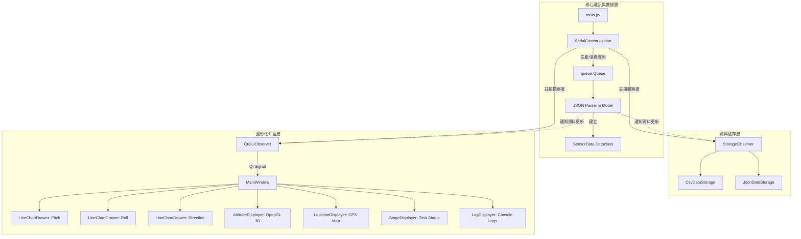
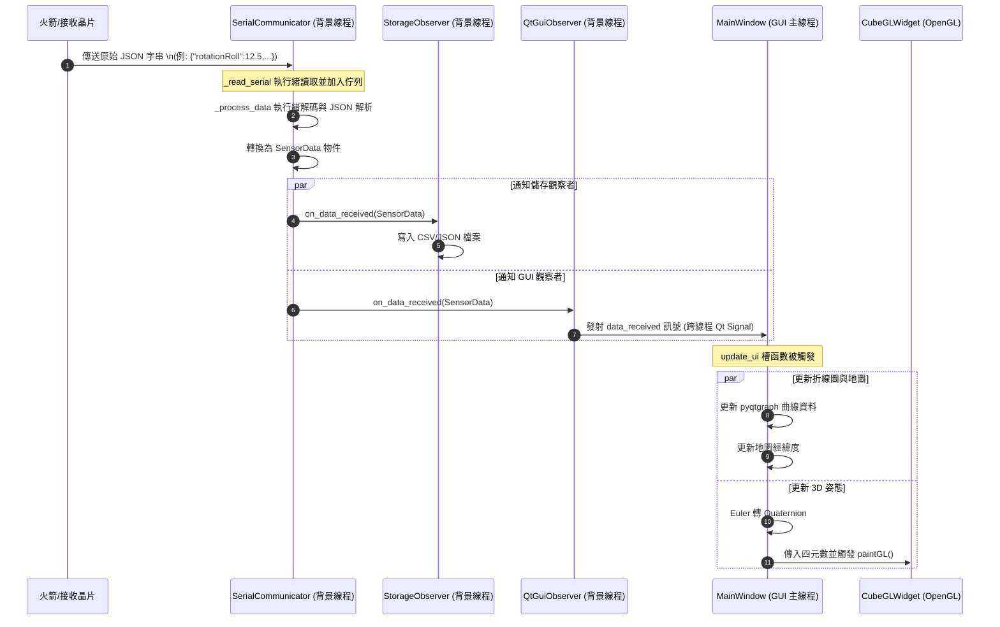

# 火箭地面站系統架構說明書 (Ground Station Architecture)

本文件說明火箭系統地面端接收與可視化程式 (`rocket_system_ground_side`) 的軟體架構與運作邏輯。

---

## 1. 系統概述 (System Overview)

本專案是一個基於 **PyQt6** 開發的火箭地面站即時監控軟體。其主要職責為：
1. **序列埠通訊**：透過 `pyserial` 從地面接收端（如 Micro:bit、LoRa 接收模組）讀取火箭傳回的即時遙測數據（JSON 格式）。
2. **多線程處理**：使用獨立的背景線程進行串列埠讀取與資料解析，避免阻礙 GUI 主線程。
3. **即時數據可視化**：
   - 使用 `pyqtgraph` 繪製實時的姿態折線圖（Pitch, Roll, Direction）。
   - 使用 `PyOpenGL` 進行 3D 立方體旋轉模擬，即時反應火箭姿態變化。
   - 地圖經緯度定位與狀態任務階段顯示。
4. **本地數據持久化**：自動將接收到的數據同步保存為 CSV 及 JSON 格式，便於後續分析。

---

## 2. 系統架構圖 (Architecture Diagram)

系統採用**觀察者模式 (Observer Pattern)** 來達到解耦目的。`SerialCommunicator` 作為主題 (Subject)，分發數據給不同的觀察者：



---

## 3. 模組職責說明 (Module Responsibilities)

### 3.1 核心模組 (`src/core`)
- **[observer.py](file:///d:/Document_J/code/rocket_system_ground_side/src/core/observer.py)**: 
  定義觀察者介面 `DataObserver`，宣告 `on_data_received` 與 `on_error` 方法。
- **[models.py](file:///d:/Document_J/code/rocket_system_ground_side/src/core/models.py)**:
  - `SensorData`: 火箭遙測數據結構（包含 roll, pitch, direction, stage, failedTasks, location, timestamp）。
  - `LogData`: 地面站日誌數據結構。
- **[communicator.py](file:///d:/Document_J/code/rocket_system_ground_side/src/core/communicator.py)**:
  - `SerialCommunicator`: 通訊核心。
  - 啟動兩個背景線程：`_read_serial`（讀取序列埠 raw 數據並存入 thread-safe 佇列）與 `_process_data`（從佇列取出並解析 JSON 轉換成 `SensorData` 物件）。
  - 具備自動斷線重連機制 (`_reconnect`)。

### 3.2 儲存模組 (`src/storage`)
- **[base.py](file:///d:/Document_J/code/rocket_system_ground_side/src/storage/base.py)**: 定義儲存抽象基類 `DataStorage`。
- **[csv_storage.py](file:///d:/Document_J/code/rocket_system_ground_side/src/storage/csv_storage.py) & [json_storage.py](file:///d:/Document_J/code/rocket_system_ground_side/src/storage/json_storage.py)**: 
  分別實現將資料寫入 CSV 檔案與 JSON 檔案。
- **[storage_observer.py](file:///d:/Document_J/code/rocket_system_ground_side/src/storage/storage_observer.py)**: 
  繼承自 `DataObserver`。當收到新遙測資料時，自動呼叫對應的儲存類別將資料寫入本地磁碟（如 `all_data_sensor.csv`）。

### 3.3 圖形化介面模組 (`src/gui`)
- **[qt_observer.py](file:///d:/Document_J/code/rocket_system_ground_side/src/gui/qt_observer.py)**: 
  作為通訊線程與 Qt 主線程的橋樑。由於 PyQt 不允許在非 GUI 線程直接修改 UI 元件，`QtGuiObserver` 透過 `QtSignalEmitter` (繼承 `QObject`) 發射 `pyqtSignal`，將數據安全地傳遞給 GUI 主線程。
- **[main_window.py](file:///d:/Document_J/code/rocket_system_ground_side/src/gui/main_window.py)**: 
  接收 GUI 訊號，調用各個可視化子元件進行 UI 更新，處理視窗底部的狀態欄、重設指令等。
- **`visualizers/`**:
  - `attitude_displayer.py`: 包含 `CubeGLWidget` (繼承自 `QOpenGLWidget`)，使用 OpenGL 根據四元數 (Quaternion) 旋轉繪製一個彩色 3D 立方體，展示火箭的姿態。
  - `line_chart.py`: 使用 `pyqtgraph` 高效繪製滾動式即時曲線圖。
  - `location_displayer.py`: GPS 經緯度座標與地圖顯示。
  - `stage_display.py`: 即時渲染火箭當前的任務階段（例如：發射準備、一級燃燒、傘降等）以及異常任務列表。
  - `log_displayer.py`: 接收系統日誌並輸出於介面上。

---

## 4. 數據串流時序圖 (Data Flow Sequence)

下圖展示了從硬體傳入原始序列埠資料，到最終 UI 更新與寫入硬碟的完整時序：



---

## 5. 通訊協定與資料格式 (Protocol & Format)

地面站期望透過序列埠接收一行一行的 **JSON 格式字串**。

### 5.1 遙測資料格式 (Telemetry Data Format)
- 範例 JSON：
  ```json
  {
    "rotationRoll": 12.5,
    "rotationPitch": -5.2,
    "direction": 180.0,
    "stage": 2,
    "failedTasks": [],
    "location": [25.0339, 121.5645]
  }
  ```
- 欄位說明：
  - `rotationRoll`: 滾轉角 (Roll, float)
  - `rotationPitch`: 俯仰角 (Pitch, float)
  - `direction`: 偏航角 / 方位角 (Yaw / Direction, float, `0`~`360`)
  - `stage`: 任務階段代碼 (integer)
  - `failedTasks`: 錯誤/失敗的任務 ID 列表 (array of integers/strings)
  - `location`: GPS 經緯度座標雙值組 `[緯度, 經度]`

---

## 6. 特色機制 (Key Features)

1. **執行緒安全 (Thread Safety)**：採用 `queue.Queue` 傳遞串口資料，並且使用 Qt 自帶的 `pyqtSignal` 傳遞解析好的資料回 GUI，解決非 GUI 執行緒直接更新 UI 造成的程式不穩定。
2. **四元數姿態計算**：在 `MainWindow.update_ui` 中，將歐拉角（Roll, Pitch, Yaw）轉換為**四元數 (Quaternion)**，接著以四元數形式傳遞給 OpenGL 矩陣做 3D 渲染，避開了萬向鎖 (Gimbal Lock) 的問題，提供平滑流暢的姿態模擬。
3. **靈活的觀察者模式**：未來若想新增其他功能（例如網路轉發遙測數據、自動語音報警），只需新增一個繼承 `DataObserver` 的類別，並調用 `communicator.add_observer()` 即可，無需更改原有的通訊與 UI 邏輯。
