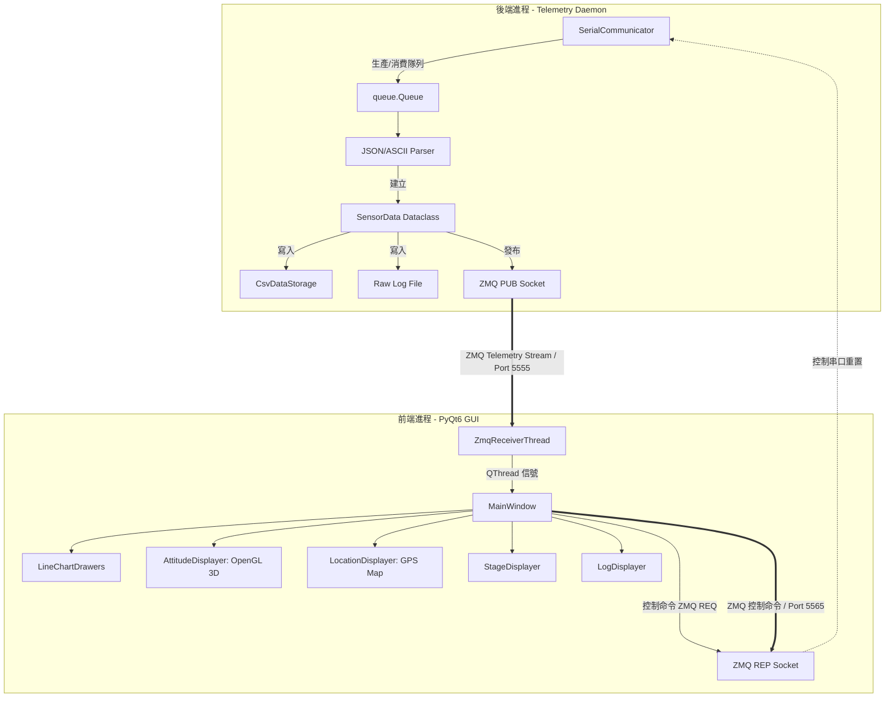
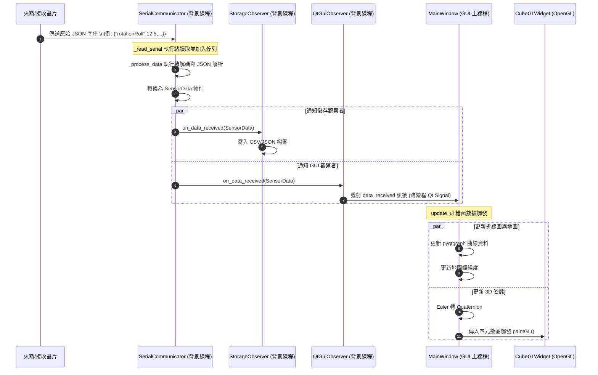

# 火箭地面站系統架構說明書 (Ground Station Architecture)

本文件說明火箭系統地面端接收與可視化程式 (`rocket_system_ground_side`) 的軟體架構與運作邏輯。

---

## 1. 系統概述 (System Overview)

本專案是一個基於 **PyQt6** 開發的火箭地面站即時監控軟體。其主要職責為：
1. **序列埠通訊**：透過 `pyserial` 從地面接收端（如 Micro:bit、LoRa 接收模組）讀取火箭傳回的即時遙測數據（JSON 格式）。
2. **多線程處理**：使用獨立的背景線程進行串列埠讀取與資料解析，避免阻礙 GUI 主線程。
3. **即時數據可視化**：
   - 使用 `pyqtgraph` 繪製實時的姿態折線圖（Pitch, Roll, Direction）。
   - 使用 `PyOpenGL` 進行 3D 立方體旋轉模擬，即時反應火箭姿態變化。
   - 地圖經緯度定位與狀態任務階段顯示。
4. **本地數據持久化**：自動將接收到的數據同步保存為 CSV 及 JSON 格式，便於後續分析。

---

## 2. 系統架構圖 (Architecture Diagram)

系統採用**多行程解耦架構 (Multi-Process Architecture)**，透過 **ZeroMQ (ZMQ)** 進行行程間通訊 (IPC)，將後端資料擷取與儲存與前端 GUI 完全獨立：



---

## 3. 模組職責說明 (Module Responsibilities)

### 3.1 核心模組 (`src/core`)
- **[observer.py](file:///d:/Document_J/code/rocket_system_ground_side/src/core/observer.py)**: 
  定義觀察者介面 `DataObserver`，宣告 `on_data_received` 與 `on_error` 方法。
- **[models.py](file:///d:/Document_J/code/rocket_system_ground_side/src/core/models.py)**:
  - `SensorData`: 火箭遙測數據結構（包含 roll, pitch, direction, stage, failedTasks, location, timestamp）。
  - `LogData`: 地面站日誌數據結構。
- **[communicator.py](file:///d:/Document_J/code/rocket_system_ground_side/src/core/communicator.py)**:
  - `SerialCommunicator`: 通訊核心。
  - 啟動兩個背景線程：`_read_serial`（讀取序列埠 raw 數據並存入 thread-safe 佇列）與 `_process_data`（從佇列取出並解析 JSON 轉換成 `SensorData` 物件）。
  - 具備自動斷線重連機制 (`_reconnect`)。

### 3.2 儲存模組 (`src/storage`)
- **[base.py](file:///d:/Document_J/code/rocket_system_ground_side/src/storage/base.py)**: 定義儲存抽象基類 `DataStorage`。
- **[csv_storage.py](file:///d:/Document_J/code/rocket_system_ground_side/src/storage/csv_storage.py) & [json_storage.py](file:///d:/Document_J/code/rocket_system_ground_side/src/storage/json_storage.py)**: 
  分別實現將資料寫入 CSV 檔案與 JSON 檔案。
- **[storage_observer.py](file:///d:/Document_J/code/rocket_system_ground_side/src/storage/storage_observer.py)**: 
  繼承自 `DataObserver`。當收到新遙測資料時，自動呼叫對應的儲存類別將資料寫入本地磁碟（如 `all_data_sensor.csv`）。

### 3.3 圖形化介面模組 (`src/gui`)
- **[qt_observer.py](file:///d:/Document_J/code/rocket_system_ground_side/src/gui/qt_observer.py)**: 
  作為通訊線程與 Qt 主線程的橋樑。由於 PyQt 不允許在非 GUI 線程直接修改 UI 元件，`QtGuiObserver` 透過 `QtSignalEmitter` (繼承 `QObject`) 發射 `pyqtSignal`，將數據安全地傳遞給 GUI 主線程。
- **[main_window.py](file:///d:/Document_J/code/rocket_system_ground_side/src/gui/main_window.py)**: 
  接收 GUI 訊號，調用各個可視化子元件進行 UI 更新，處理視窗底部的狀態欄、重設指令等。
- **`visualizers/`**:
  - `attitude_displayer.py`: 包含 `CubeGLWidget` (繼承自 `QOpenGLWidget`)，使用 OpenGL 根據四元數 (Quaternion) 旋轉繪製一個彩色 3D 立方體，展示火箭的姿態。
  - `line_chart.py`: 使用 `pyqtgraph` 高效繪製滾動式即時曲線圖。
  - `location_displayer.py`: GPS 經緯度座標與地圖顯示。
  - `stage_display.py`: 即時渲染火箭當前的任務階段（例如：發射準備、一級燃燒、傘降等）以及異常任務列表。
  - `log_displayer.py`: 接收系統日誌並輸出於介面上。

---

## 4. 數據串流時序圖 (Data Flow Sequence)

下圖展示了從硬體傳入原始序列埠資料，到最終 UI 更新與寫入硬碟的完整時序：



---

## 5. 通訊協定與資料格式 (Protocol & Format)

地面站支援兩種序列埠接收格式，並在內部以 ZMQ IPC 序列化傳輸：

### 5.1 序列埠輸入協定 (Serial Ingestion Protocols)

後端守護進程能動態識別並相容解析以下兩種格式：
1. **新版優化 ASCII 格式**（詳細規格請參閱 [telemetry_format.md](file:///d:/Document_J/code/rocket_system_ground_side/doc/telemetry_format.md)）：
   使用空格分隔，Key-Value 前綴。範例如下：
   ```text
   T28386 AX+0.007 AY+0.026 AZ+0.978 GX+6.09 GY-1.05 GZ-2.80 P997.92 RH-0.1 KH-0.1 VZ+0.00 GA0.98 ST:0 MOD:E GPS:1,8 C:0 LAT+25.04213 LON+121.53489
   ```
2. **舊版 JSON 格式**：
   ```json
   {
     "rotationRoll": 12.5,
     "rotationPitch": -5.2,
     "direction": 180.0,
     "stage": 2,
     "failedTasks": [],
     "location": [25.0339, 121.5645]
   }
   ```

### 5.2 行程間通訊格式 (ZMQ IPC JSON Format)

當後端 Daemon 解析完成後，會將數據結構化為包含完整遙測屬性的 [SensorData](file:///d:/Document_J/code/rocket_system_ground_side/src/core/models.py#L9) 字典，並在 `timestamp` 外額外添加 `gs_timestamp`（地面站接收時間戳，以毫秒為單位）進行 ZMQ 發布：

```json
{
  "rotationRoll": 1.523,
  "rotationPitch": -0.41,
  "direction": 180.0,
  "timestamp": "2026-07-19T19:36:04.123456",
  "gs_timestamp": 1784547364.123,
  "stage": 0,
  "failedTasks": [],
  "location": [25.04213, 121.53489],
  "timestamp_ms": 28386,
  "ax": 0.007,
  "ay": 0.026,
  "az": 0.978,
  "gx": 6.09,
  "gy": -1.05,
  "gz": -2.8,
  "pressure": 997.92,
  "rel_height": -0.1,
  "kfh_height": -0.1,
  "vz": 0.0,
  "total_accel": 0.98,
  "temp": 25.1,
  "raw_adc": 6386686,
  "flight_state": "IDLE",
  "module_state": "E",
  "gnss_state": "FIX_3D",
  "sv_visible": 8,
  "sv_used": 5,
  "buffer_val": 7373,
  "count_val": 266,
  "cond_a_raw": 1,
  "cond_a_eff": 0,
  "cond_b_raw": 1,
  "cond_b_eff": 0,
  "peak_height": 0.0,
  "sd_writes": 0,
  "lora_seq": 50,
  "lora_success": 49,
  "lora_total": 49
}
```

---

## 6. 特色機制 (Key Features)

1. **多行程隔離與資料保底 (Process Isolation & Data Safety)**：後端接收程式獨立運行，並在接收到串列資料的第一瞬間即寫入 `logs/raw_ch[X]_<timestamp>.log`。即使 GUI 崩潰，資料寫入仍 100% 正常進行。
2. **四元數姿態計算**：在 `MainWindow.update_ui` 中，將歐拉角（Roll, Pitch, Yaw）轉換為**四元數 (Quaternion)**，接著以四元數形式傳遞給 OpenGL 矩陣做 3D 渲染，避開了萬向鎖 (Gimbal Lock) 的問題，提供平滑流暢的姿態模擬。
3. **無阻塞與雙通道準備 (ZMQ IPC & Non-blocking GUI)**：GUI 通過 `ZmqReceiverThread` (QThread) 非阻塞訂閱遙測數據。UI 設定變更（例如變更 Com Port 或 Baudrate）均通過設定超時的 ZMQ REQ/REP 通道異步傳輸給後端進程，絕不卡死 GUI 主線程。

---

## 7. 啟動與執行方式 (Execution Guide)

系統採用自動協調進程設計，使用者只需透過單一入口即可完整啟動：

### 7.1 一鍵啟動 (推薦)
在專案根目錄，使用 Python 運行主入口：
```bash
python main.py
```
* **運作邏輯**：主入口會以 `subprocess.Popen` 在背景自動生成後端守護進程（`src/backend_daemon.py`，預設為 `ch1`），並同時拉起前端 GUI 視窗。當 GUI 被關閉時，主進程會自動清理並終止背景的後端進程。

### 7.2 背景持續寫入與分離啟動 (Decoupled Background Execution)
如果您希望在 GUI 關閉後，背景依然能夠持續寫入遙測資料，或者單獨測試調試後端或前端，本系統支援**獨立背景守護模式**與**GUI 獨立啟動模式**。

本專案提供了以下三個便捷的批次檔 (Batch Scripts) 供您直接雙擊運行：
1. **[run_backend_ch1.bat](file:///d:/Document_J/code/rocket_system_ground_side/run_backend_ch1.bat)**：獨立在背景啟動通道 1 的遙測數據後端（會加上 `--standalone` 參數以防止父進程自毀監聽），持續接收序列埠遙測資料並寫入 `logs/` 與 `data/`，不受 GUI 啟閉影響。
2. **[run_gui_only.bat](file:///d:/Document_J/code/rocket_system_ground_side/run_gui_only.bat)**：以 `--gui-only` 模式啟動前端 GUI 視窗，它會直接連線至已啟動的背景後端，關閉 GUI 時不會終止背景後端。
3. **[run_persist_backend.bat](file:///d:/Document_J/code/rocket_system_ground_side/run_persist_backend.bat)**：一鍵以新視窗拉起獨立後端並於當前視窗拉起 GUI，在關閉 GUI 時後端視窗依舊維持運行。

亦可使用命令列手動操作：

1. **手動啟動獨立後端進程 (Backend Daemon)**：
   ```bash
   python src/backend_daemon.py --channel ch1 --standalone
   ```
   * `--channel`: 指定通道識別碼 (`ch1` 或 `ch2`)
   * `--standalone`: **關鍵參數**。指定此參數後，後端進程將不會監聽父進程 stdin，保證 GUI 關閉後依然持續執行寫入檔案。
   * `--port` (選填): 指定序列埠名稱（若無提供，將自動載入 `settings.json` 設定）
   * `--baud` (選填): 指定鮑率（若無提供，將自動載入 `settings.json` 設定）

2. **手動啟動前端 GUI 行程 (PyQt6 Visualizer)**：
   您可以單獨運行 GUI，並使用 `--gui-only` 確保它不重複拉起後端：
   ```bash
   python main.py --gui-only
   ```
   * **智慧偵測**：即使不加上 `--gui-only`，`main.py` 也會自動檢查 ZMQ 連接埠是否已被佔用。若是已被佔用（代表後端已手動開啟），會自動轉為僅啟動 GUI 並跳過生成與清理後端的步驟。


